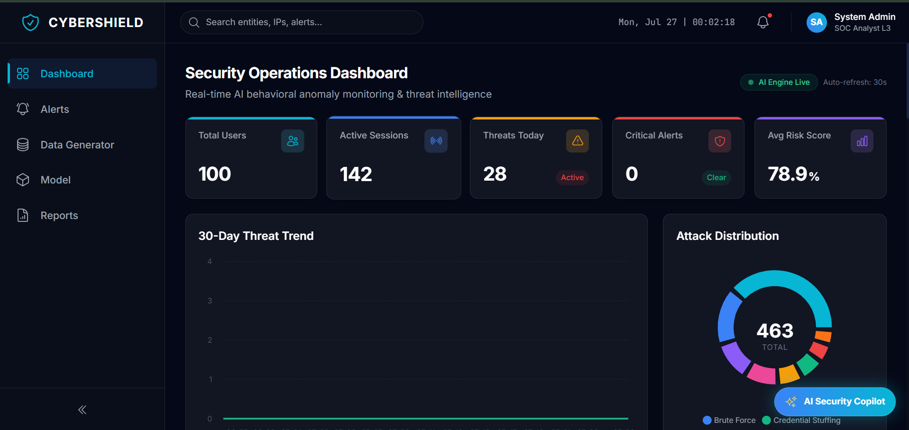
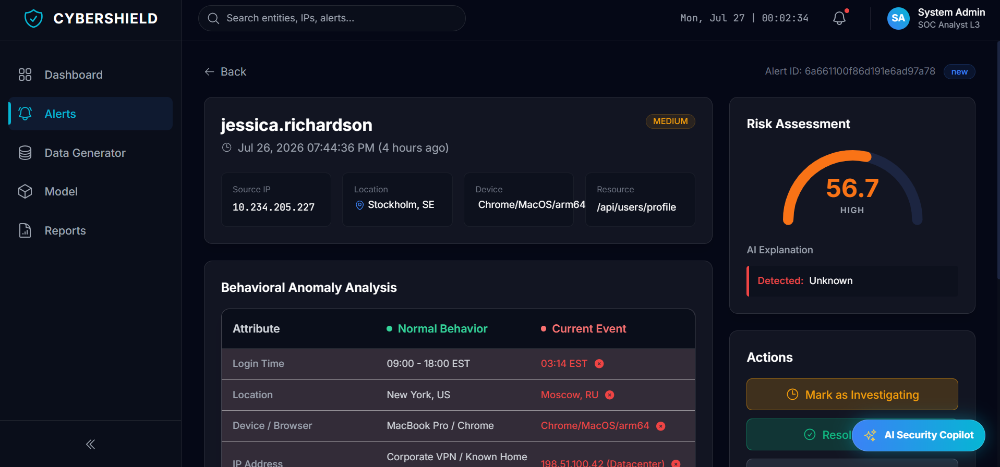
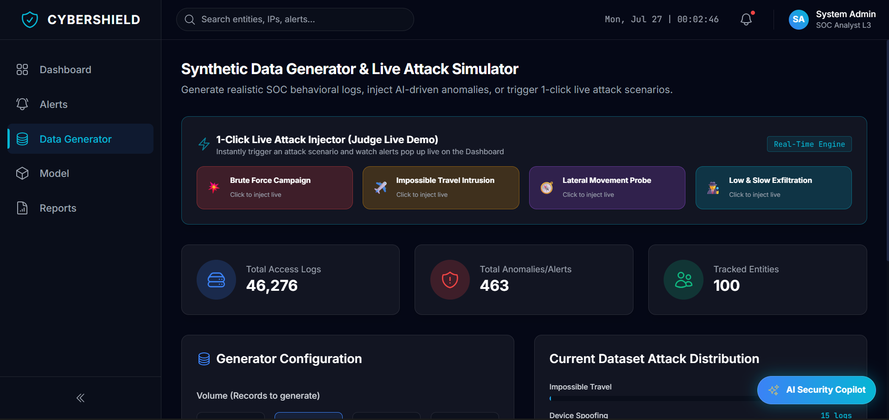
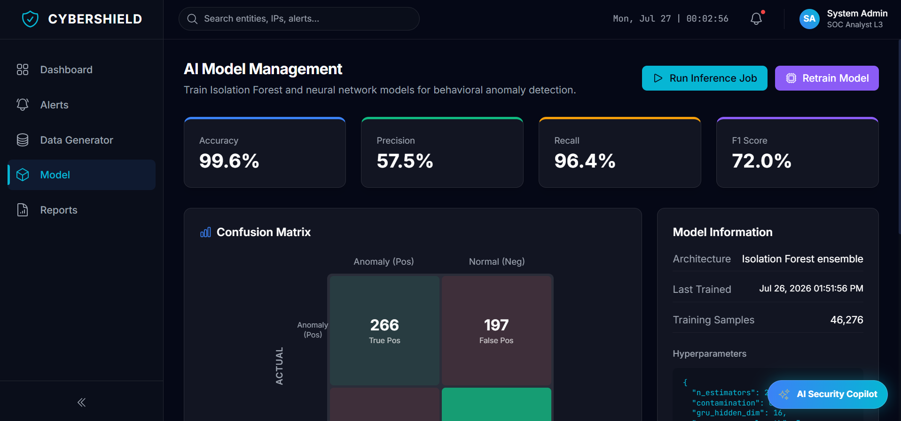
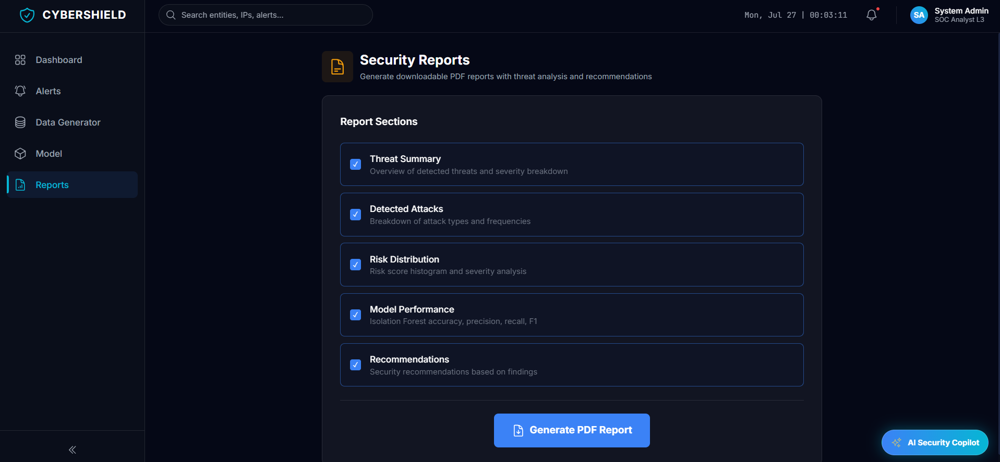
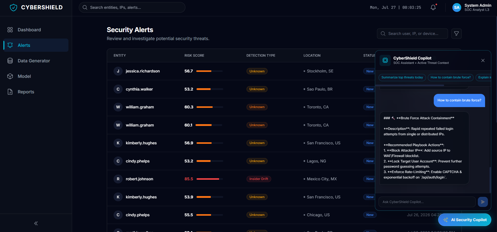

# 🛡️ CyberShield: AI-Powered Behavioral Anomaly Detection Platform

> An AI-powered Security Monitoring Platform that detects abnormal user behaviour, identifies cyber threats using machine learning, explains security risks with Explainable AI (XAI), and assists analysts with intelligent incident response recommendations.
> Live Link = https://honeywell-beta.vercel.app/

---

## 🚀 Overview

CyberShield is a Security Operations Center (SOC) platform designed to monitor authentication logs, identify suspicious user behaviour, classify cyber attacks, and provide actionable recommendations.

The platform combines machine learning, interactive dashboards, MITRE ATT&CK mapping, and AI-assisted threat investigation to help security analysts detect and respond to security incidents faster.

---

## ✨ Key Features

- 🔍 Behavioral Anomaly Detection using Isolation Forest
- 🧠 Temporal Sequence Analysis using GRU
- 🎯 Attack Classification using Random Forest
- 📊 Interactive Security Dashboard
- 🗺️ MITRE ATT&CK Threat Mapping
- 🤖 AI Security Copilot
- ⚡ Live SIEM Event Monitoring
- 🛡️ SOAR Incident Response Simulation
- 📄 Executive PDF Report Generation
- 📈 Explainable AI (XAI) for threat reasoning

---
## Project Screenshots

### DashBoard Page


### Alerts


### Data Generator
 

### Model


### Reports
 

### ChatBot



---

# 🧠 AI Pipeline

```text
Authentication Logs
        │
        ▼
Feature Engineering
        │
        ▼
Isolation Forest
(Point Anomaly Detection)
        │
        ▼
GRU Sequence Analysis
(Behavior Learning)
        │
        ▼
Random Forest
(Attack Classification)
        │
        ▼
Risk Scoring Engine
        │
        ▼
Explainable AI
        │
        ▼
Dashboard & SOAR Recommendations
```

---

# 🏗 System Architecture

```text
Log Generator / SIEM
        │
        ▼
MongoDB Database
        │
        ▼
Feature Extraction
        │
 ┌───────────────┐
 │ IsolationForest│
 └───────────────┘
        │
 ┌───────────────┐
 │ GRU Network   │
 └───────────────┘
        │
 ┌───────────────┐
 │ Random Forest │
 └───────────────┘
        │
        ▼
Risk Scoring
        │
        ▼
Explainable AI
        │
        ▼
SOC Dashboard
```

---

# 🛠 Technology Stack

### Frontend

- React.js
- Vite
- Tailwind CSS
- Recharts
- Framer Motion
- React Icons

### Backend

- FastAPI
- Python
- Scikit-learn
- Pandas
- NumPy
- ReportLab

### Database

- MongoDB

### Machine Learning

- Isolation Forest
- GRU Neural Network
- Random Forest
- Explainable AI

---

# 📊 Dashboard Modules

- Executive Dashboard
- Threat Analytics
- Alert Management
- Entity Behaviour Analysis
- MITRE ATT&CK Matrix
- Login Heatmap
- World Threat Map
- AI Copilot
- Live Event Stream
- Executive Reports

---

# 🔍 AI Detection Workflow

1. Generate or ingest authentication logs.
2. Extract behavioural features.
3. Detect anomalies using Isolation Forest.
4. Analyse user behaviour sequences with GRU.
5. Classify attack type using Random Forest.
6. Calculate risk score.
7. Generate AI explanations.
8. Recommend response actions.
9. Visualize results on dashboard.

---

# 📈 Supported Threat Types

- Brute Force Attack
- Credential Stuffing
- Impossible Travel
- Device Spoofing
- Insider Threat
- Lateral Movement
- Low & Slow Data Exfiltration
- Privilege Abuse

---

# 🛡 SOAR Response Simulation

The platform demonstrates automated security response playbooks:

- Lock User Account
- Revoke Active Sessions
- Block Suspicious IP
- Force Password Reset
- Require MFA
- Notify Security Team

---

# 🤖 AI Security Copilot

The integrated AI assistant can answer questions such as:

- Summarize today's threats
- Explain attack severity
- Why was this alert generated?
- Suggest mitigation steps
- Explain MITRE technique
- Recommend containment strategy

---

# 📄 Explainable AI

Each alert includes:

- Risk Score
- Threat Severity
- Feature Importance
- Attack Classification
- Explanation of Detection
- Recommended Actions
- Confidence Score

---

# 📊 Reports

Generate downloadable reports including:

- Executive Security Report
- Threat Summary
- Alert Statistics
- Risk Distribution
- Top Attack Categories
- AI Recommendations

---

# 📂 Project Structure

```
CyberShield/
│
├── backend/
│   ├── app/
│   ├── models/
│   ├── routers/
│   ├── services/
│   ├── utils/
│   └── requirements.txt
│
├── frontend/
│   ├── src/
│   ├── components/
│   ├── pages/
│   ├── hooks/
│   ├── api/
│   └── package.json
│
└── README.md
```

---

# ⚙ Installation

## Clone Repository

```bash
git clone <repository-url>
cd CyberShield
```

## Backend

```bash
cd backend

python -m venv venv

source venv/bin/activate
# Windows
venv\Scripts\activate

pip install -r requirements.txt

uvicorn app.main:app --reload
```

Backend runs at

```
http://localhost:8000
```

API Docs

```
http://localhost:8000/docs
```

---

## Frontend

```bash
cd frontend

npm install

npm run dev
```

Frontend

```
http://localhost:5173
```

---

# 🚀 Demo Workflow

1. Generate synthetic SIEM logs.
2. Train AI models.
3. Run threat detection.
4. View alerts.
5. Investigate anomalies.
6. Ask AI Copilot.
7. Execute SOAR simulation.
8. Export executive report.

---

# 📡 REST APIs

| Method | Endpoint | Description |
|---------|----------|-------------|
| GET | /dashboard | Dashboard statistics |
| GET | /alerts | List alerts |
| GET | /alerts/{id} | Alert details |
| POST | /generator | Generate dataset |
| POST | /model/train | Train models |
| POST | /model/predict | Run prediction |
| POST | /reports | Generate PDF |
| POST | /copilot | AI assistant |

---

# 📷 Screenshots

- Dashboard
- Alert Details
- Threat Analytics
- MITRE ATT&CK Matrix
- AI Copilot
- Reports

---

# 🔮 Future Enhancements

- Docker Deployment
- Kubernetes Support
- Kafka Event Streaming
- Elastic Stack Integration
- Splunk Integration
- Azure Sentinel Integration
- Real-time Log Ingestion
- Online Model Retraining
- Multi-tenant Architecture

---

# 👨‍💻 Author

**Tejas Ashok Desale**

B.Tech Information Technology

Vishwakarma Institute of Technology, Pune

---

# 📜 License

This project is developed for educational, research, and hackathon purposes. It demonstrates AI-assisted cybersecurity monitoring, behavioural anomaly detection, and intelligent security analytics.
