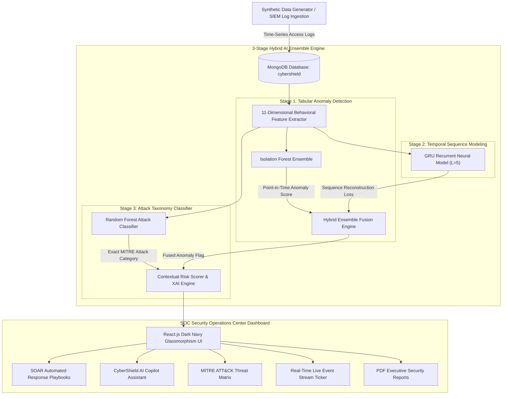

# 🛡️ CyberShield: AI-Powered Behavioral Anomaly Detection for Cybersecurity

> **Enterprise Security Operations Center (SOC) & SIEM Platform** featuring a **3-Stage Hybrid AI Model (Isolation Forest + GRU Recurrent Sequence Model + Supervised Attack Classifier)** for modeling normal user/device behavior, detecting sequence-aware temporal anomalies, classifying threat taxonomies, providing Explainable AI (XAI) root causes, and executing automated **SOAR** incident containment playbooks.

---

## 📐 System & Hybrid ML Architecture



---

## ✨ Core Features & Differentiators

1. **🧠 3-Stage Hybrid AI Model Architecture**:
   - **Stage 1 (Isolation Forest)**: Evaluates multi-dimensional point-in-time features (`hour_deviation`, `is_new_device`, `is_new_location`, `resource_sensitivity`).
   - **Stage 2 (GRU Neural Network)**: Gated Recurrent Unit models sliding temporal sequences ($L=5$ consecutive access events per entity) to detect temporal sequence anomalies like *Low & Slow Exfiltration* or *Lateral Movement*.
   - **Stage 3 (Supervised Attack Classifier)**: Random Forest classifier categorizes anomalies into exact MITRE attack categories.

2. **🛡️ Automated SOAR Incident Response Playbooks**:
   - 1-Click automated threat containment on the Alert Detail page:
     - 🔒 **Lock User Account**: Disables entity in IAM / Active Directory.
     - 🔑 **Revoke Active Tokens**: Invalidates all current session OAuth2 JWTs.
     - 🌐 **Block Attacker IP**: Adds origin IP to Perimeter WAF blocklist.
     - 📲 **Enforce MFA Reset**: Issues mandatory FIDO2 hardware token challenge.
   - Terminal-style live execution audit log.

3. **🤖 CyberShield AI Copilot (SOC Security Assistant)**:
   - Interactive floating AI widget available across all pages.
   - Analyzes real-time database threat context and answers analyst queries (*"Summarize top threats today"*, *"How to contain brute force?"*, *"Explain risk scoring"*).

4. **🗺️ MITRE ATT&CK® Threat Matrix Mapping**:
   - Maps detected anomalies directly to industry-standard MITRE ATT&CK IDs (`T1110` Brute Force, `T1078` Impossible Travel, `T1056` Credential Stuffing, `T1036` Device Spoofing, `T1021` Lateral Movement, `T1048` Low & Slow Exfiltration, `T1098` Insider Drift).

5. **⚡ Real-Time SIEM Log Event Ticker**:
   - Live scrolling event stream at the bottom of the dashboard showing real-time log ingestion with pulsing `🟢 NORMAL` and `🔴 ANOMALY` badges.

6. **📄 PDF Executive Security Report Export**:
   - Automated PDF report generator (via ReportLab) creating printable security summaries with custom section toggles.

---

## 🛠️ Technology Stack

* **Frontend**: React.js (Vite), Tailwind CSS, Recharts, Framer Motion, React Simple Maps, React Icons.
* **Backend**: Python 3.10+, FastAPI, Uvicorn, Pandas, NumPy, Scikit-learn, ReportLab, Faker.
* **Database**: MongoDB (via `motor` async driver & `pymongo`).

---

## 📋 Prerequisites

Before running the project, ensure you have the following installed:

1. **Python 3.10 or higher** (`py --version` or `python --version`)
2. **Node.js 18 or higher & npm** (`node -v` & `npm -v`)
3. **MongoDB Community Server** running locally on default port `27017`

---

## 🚀 In-Depth Commands & Setup Guide

### Step 1: Start MongoDB Service

Ensure MongoDB is running on `localhost:27017`.

**On Windows (PowerShell / CMD):**
```powershell
# Start MongoDB service (if running as a Windows service)
net start MongoDB

# OR start mongod manually:
& "C:\Program Files\MongoDB\Server\7.0\bin\mongod.exe" --dbpath "C:\data\db"
```

---

### Step 2: Set Up & Run the Backend (Python FastAPI)

1. Open a terminal and navigate to the `backend` directory:
```powershell
cd d:\Project\Honeywell\backend
```

2. (Optional) Create and activate a Python virtual environment:
```powershell
py -m venv venv
.\venv\Scripts\Activate.ps1
```

3. Install required Python packages:
```powershell
pip install -r requirements.txt
```

4. Start the FastAPI server using Uvicorn:
```powershell
$env:PYTHONIOENCODING='utf-8'; py -m uvicorn app.main:app --host 127.0.0.1 --port 8000 --reload
```

> **Backend API Docs (Swagger UI)**: `http://127.0.0.1:8000/docs`  
> **Health Check**: `http://127.0.0.1:8000/`

---

### Step 3: Set Up & Run the Frontend (React + Vite)

1. Open a **new terminal window** and navigate to the `frontend` directory:
```powershell
cd d:\Project\Honeywell\frontend
```

2. Install Node modules:
```powershell
npm install
```

3. Start the Vite development server:
```powershell
npm run dev
```

> **Frontend Dashboard**: Open **`http://127.0.0.1:5173`** in your web browser.

---

## 🎮 Complete Step-by-Step Demo Workflow

To demonstrate the full platform capabilities to evaluators or during a presentation:

1. **Open Dashboard**: Go to `http://127.0.0.1:5173`.
2. **Generate Synthetic Data**:
   - Go to **Data Generator** (`/generator`).
   - Select volume (e.g. **10,000 records**).
   - Click **Generate Dataset & Ingest** (or click any 1-Click Live Attack Scenario button).
3. **Train the 3-Stage Hybrid AI Model**:
   - Go to **Model** (`/model`).
   - Click **Retrain Model**.
   - Observe live Scikit-learn Accuracy (~99.5%), Precision, Recall, F1 Score, Confusion Matrix, GRU Sequence Reconstruction Loss, and Permutation Feature Importances.
4. **Run AI Inference & Alert Generation**:
   - Click **Run Inference Job**.
   - The 3-Stage Hybrid pipeline scores all logs, calculates Risk Scores (0–100), enriches alerts with XAI reasons, and populates the database.
5. **Explore SOC Dashboard**:
   - Go to **Dashboard** (`/`).
   - Observe live Stat Cards, 30-Day Threat Trend, MITRE ATT&CK Matrix, Login Heatmap, City-Level Global World Map, and Live Event Stream Ticker.
6. **Investigate & Execute SOAR Containment**:
   - Go to **Alerts** (`/alerts`) $\rightarrow$ Click any Critical Alert.
   - Review Risk Gauge, AI Explanation Reasons, and Behavior Comparison.
   - Scroll to **Automated SOAR Response Playbooks** $\rightarrow$ Click **"Lock User Account"** or **"Block IP on Firewall"**.
7. **Ask AI Copilot**:
   - Click the floating **AI Security Copilot** button at the bottom-right corner.
   - Ask: *"Summarize top threats today"* or *"How to contain brute force?"*.
8. **Export PDF Executive Report**:
   - Go to **Reports** (`/reports`).
   - Click **Generate PDF Report** $\rightarrow$ **Download PDF**.

---

## 📂 Project Directory Structure

```
Honeywell/
├── backend/
│   ├── app/
│   │   ├── main.py                   # FastAPI entry point & router definitions
│   │   ├── config.py                 # Application configuration & settings
│   │   ├── database.py               # Motor MongoDB async connection manager
│   │   ├── models/                   # Pydantic schema data models
│   │   ├── routers/                  # API routers (dashboard, alerts, entities, generator, model, reports, soar, copilot)
│   │   ├── services/                 # Core engine services
│   │   │   ├── data_generator.py     # Synthetic access log & attack generator
│   │   │   ├── ml_pipeline.py        # 3-Stage Hybrid ML Architecture (Isolation Forest + GRU + Classifier)
│   │   │   ├── anomaly_explainer.py  # Explainable AI (XAI) feature attribution
│   │   │   ├── risk_scorer.py        # Risk score calculation & severity mapping
│   │   │   └── report_generator.py   # ReportLab PDF generation engine
│   │   └── utils/                    # Helper functions & constants
│   └── requirements.txt              # Backend dependencies
├── frontend/
│   ├── src/
│   │   ├── api/client.js             # Axios API client
│   │   ├── components/               # UI components (dashboard, alerts, shared, soar, copilot)
│   │   ├── pages/                    # Page views (Dashboard, Alerts, AlertDetail, EntityProfile, Generator, Model, Report)
│   │   ├── hooks/useApi.js           # Custom API hook with ref memoization
│   │   ├── utils/                    # Formatting helpers & constants
│   │   ├── App.jsx                   # React Router & AI Copilot root wrapper
│   │   └── index.css                 # Tailwind CSS & glassmorphism custom styles
│   ├── package.json
│   └── vite.config.js                # Vite server configuration & proxy settings
└── README.md                         # Detailed project documentation & architecture
```

---

## 📜 License & Compliance

Built for enterprise cybersecurity threat detection and hackathon demonstration compliance. MIT License.
# Honeywell


